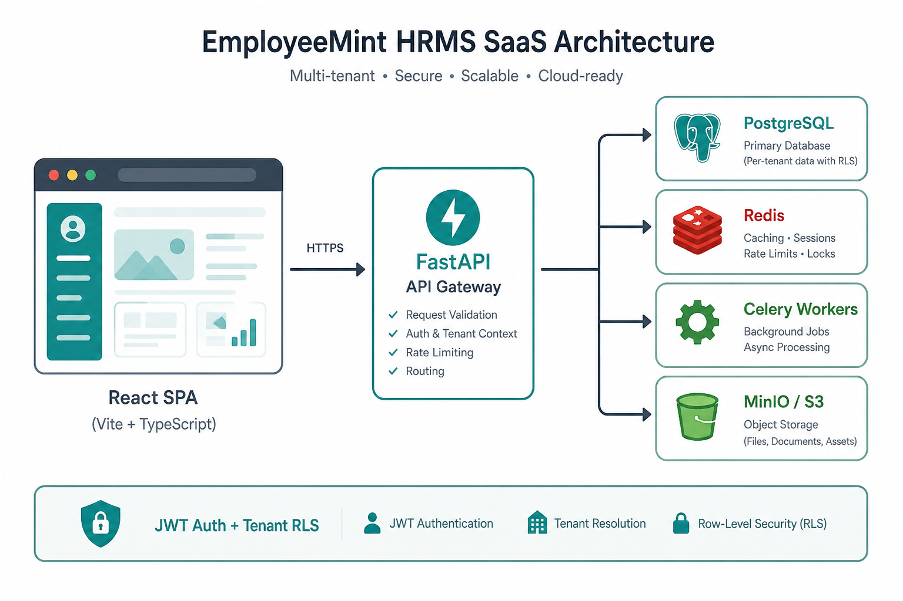
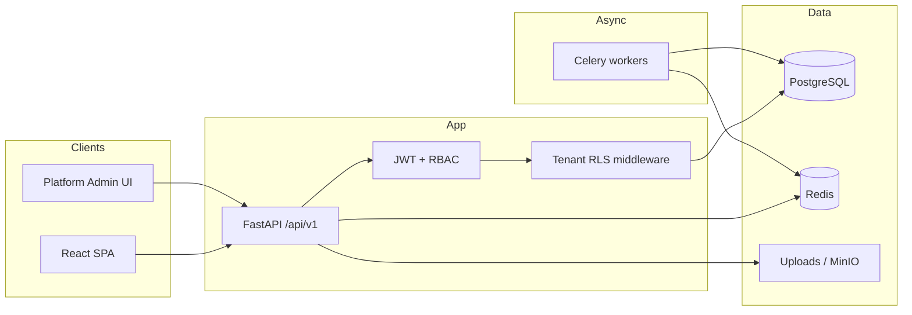
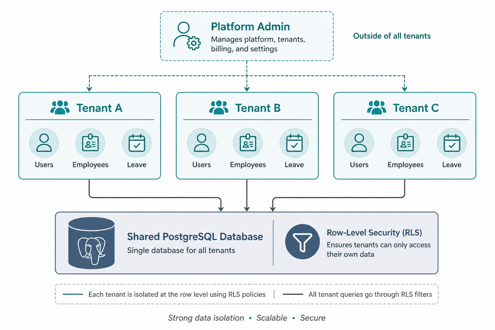
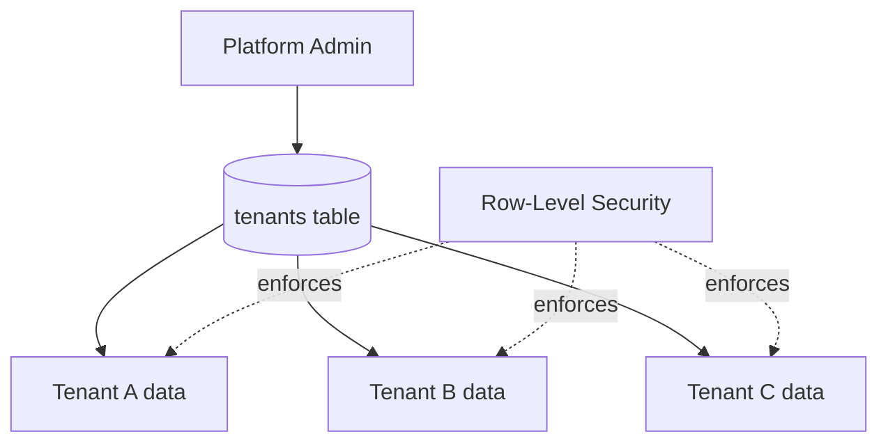
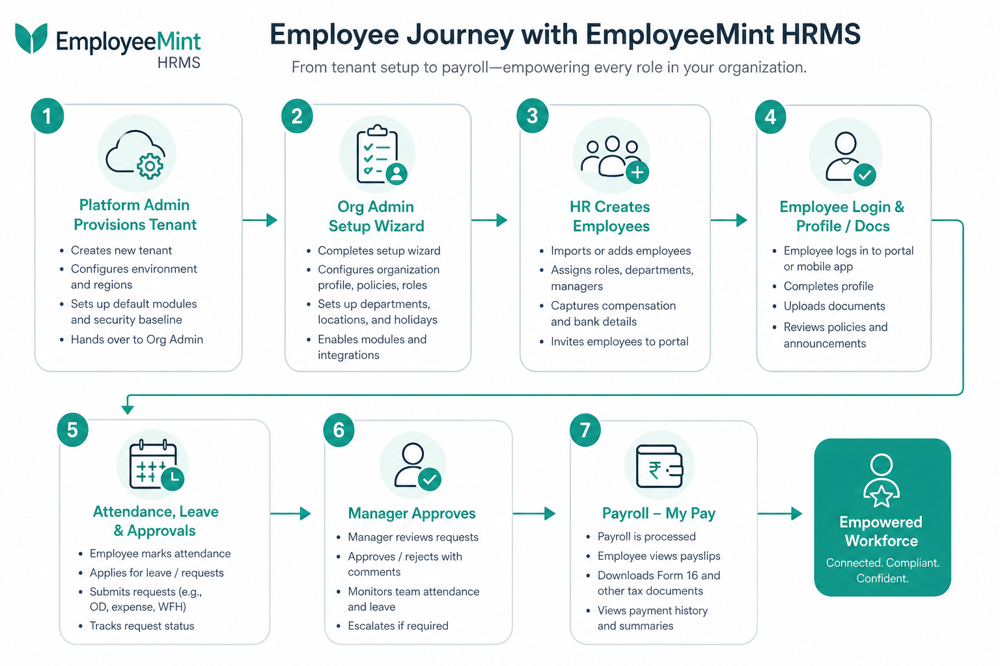
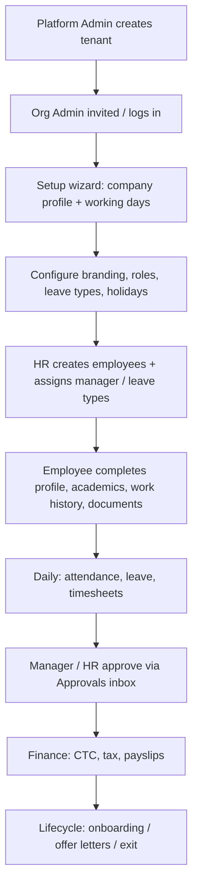
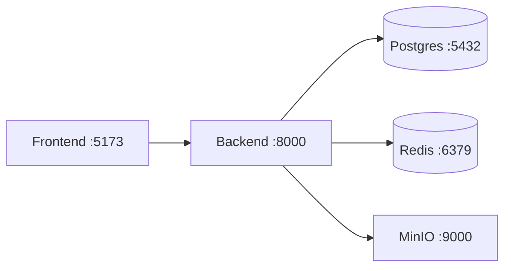

# EmployeeMint — High Level Design (HLD)

**Product:** Multi-tenant HRMS SaaS  
**Audience:** Architects, tech leads, stakeholders  
**Related:** [LLD](./LLD.md) · [SPEC](./SPEC.md)

---

## 1. Brief — what was built

**EmployeeMint** is a configuration-driven, multi-tenant Human Resource Management System for companies roughly **10–5,000 employees**.

A **platform operator** provisions customer organizations (tenants). Each tenant’s **Org Admin / HR** configures leave, roles, workflows, branding, and org structure without code changes. **Employees** and **managers** use day-to-day modules: attendance, leave, timesheets, pay, profile/documents, approvals, and team/org views.

### Design principle

> **Configuration over code** — leave types, approval chains, designations, holidays, branding, and modules differ per tenant and live in the database, not hardcoded logic.

### Capabilities delivered (summary)

| Area | Capabilities |
|------|----------------|
| Platform | Tenant create/manage, impersonation support mode |
| Tenant setup | Guided wizard (company profile, working days) |
| People | Employees CRUD, org chart, my team (reportees or peers) |
| Identity & access | JWT auth, RBAC roles/permissions, module visibility |
| Time | Attendance check-in/out, WFH, timesheets |
| Leave | Apply, balances, policies, multi-step approvals |
| Finance | Compensation/CTC, tax preview, payslips view, reimbursements |
| Lifecycle | Onboarding tasks, offboarding, offer letters |
| Profile | Avatar, documents, academic & work history, background verification (HR) |
| Branding | Org name + logo in sidebar/top bar |
| Comms | Announcements ticker, in-app notifications |

---

## 2. Tech stack

### Backend

| Layer | Choice |
|-------|--------|
| Runtime | Python 3.12+ |
| API | FastAPI + Pydantic v2 |
| ORM / DB | SQLAlchemy 2.x (async) + PostgreSQL 16 |
| Migrations | Alembic |
| Cache / queue | Redis 7 |
| Workers | Celery (async jobs) |
| Auth | JWT access + refresh (tenant + permissions in claims) |
| Files | Local uploads (+ S3/MinIO-ready for objects) |
| Tenancy | Shared DB/schema + `tenant_id` + PostgreSQL RLS |

### Frontend

| Layer | Choice |
|-------|--------|
| UI | React 18 + TypeScript |
| Build | Vite |
| Server state | TanStack Query |
| Client state | Zustand (auth, theme) |
| Routing | React Router v6 |
| Styling | Tailwind CSS |
| Forms | React Hook Form + Zod (where used) |
| Icons | Lucide |

### Infrastructure (local / compose)

| Service | Role |
|---------|------|
| PostgreSQL | Primary datastore |
| Redis | Cache, Celery broker |
| MinIO | S3-compatible object storage |
| Docker Compose | Orchestration |

---

## 3. System context (architecture)





### Request path (tenant user)

1. Browser sends `Authorization: Bearer <access_token>`.
2. API verifies JWT → extracts `tenant_id` + `permissions`.
3. Middleware sets Postgres `app.current_tenant_id` for RLS.
4. Service layer executes business rules; routers return Pydantic responses.
5. Frontend caches via TanStack Query; auth user in Zustand.

---

## 4. Multi-tenancy





- **Shared database, shared schema.**
- Every tenant-scoped row has `tenant_id`.
- Platform tables (`platform_admins`, `tenants`, …) sit outside tenant RLS.
- Never trust `tenant_id` from the client body — always from the session/JWT.

---

## 5. Users & roles

| Actor | Who | Typical access |
|-------|-----|----------------|
| **Platform Admin** | EmployeeMint operator | Create tenants, view tenant admins, support impersonation |
| **Org Admin** | Customer company admin | Full tenant config (`*` / broad permissions) |
| **HR Admin / Executive** | HR team | Employees, onboarding, leave policies, background checks, org |
| **Reporting Manager** | Line manager | Team attendance/leave, approvals, my team |
| **Finance Admin** | Payroll/finance | Payroll views, reimbursements, reports |
| **Employee** | Individual contributor | Own attendance, leave, pay, profile, documents |

Permissions are **codes** (e.g. `leave.apply`, `employee.view.all`) assigned via **roles**. Nav modules show/hide based on permission prefixes.

---

## 6. End-to-end user journey





### Key product flows (HLD view)

| Flow | Actors | Outcome |
|------|--------|---------|
| Tenant provision | Platform Admin | Isolated workspace + default roles |
| Setup wizard | Org Admin | Tenant marked setup-complete |
| Employee hire | HR | User + employee + roles + leave balances |
| Leave apply → approve | Employee → Manager | Balance updated, notifications |
| Background check | Employee fills profile → HR reviews | Verification status on employee |
| Branding | Org/HR Admin | Name + logo in sidebar & top bar |

---

## 7. Logical modules (frontend ↔ API)

```mermaid
flowchart TB
  subgraph Frontend features
    Dash[Dashboard]
    Emp[Employees]
    Att[Attendance]
    Leave[Leave]
    TS[Timesheets]
    Pay[My Pay]
    Appr[Approvals]
    Org[Organization / My Team]
    Life[HR Lifecycle]
    Prof[Profile]
    Set[Settings]
    Plat[Platform]
  end

  subgraph API domains
    aAuth[/auth]
    aEmp[/employees + employee-details]
    aAtt[/attendance]
    aLeave[/leave]
    aFin[/finance]
    aAppr[/approvals]
    aDash[/dashboard /organization /my-team]
    aLife[/lifecycle /onboarding…]
    aSet[/settings]
    aPlat[/platform]
  end

  Dash --> aDash
  Emp --> aEmp
  Att --> aAtt
  Leave --> aLeave
  Pay --> aFin
  Appr --> aAppr
  Org --> aDash
  Life --> aLife
  Prof --> aAuth
  Prof --> aEmp
  Set --> aSet
  Plat --> aPlat
```

---

## 8. Non-functional design

| Concern | Approach |
|---------|----------|
| Security | JWT, hashed passwords, permission checks, RLS |
| Isolation | Tenant ID everywhere + RLS session variable |
| Auditability | Soft deletes, timestamps, notifications |
| Extensibility | Permission seed + role matrix; module flags on tenant |
| Operability | Docker Compose, Alembic migrations, OpenAPI at `/docs` |
| UX | Role-based nav, branding, announcement ticker, notifications |

---

## 9. Deployment topology (local)



| URL | Service |
|-----|---------|
| http://localhost:5173 | React app |
| http://localhost:8000 | FastAPI (+ `/docs`) |
| http://localhost:9001 | MinIO console |

---

## 10. Document map

| Doc | Purpose |
|-----|---------|
| **HLD** (this file) | Vision, stack, context, users, journeys |
| **[LLD](./LLD.md)** | Packages, APIs, data model, detailed sequences |
| **[SPEC](./SPEC.md)** | Product contract / build prompt |

---

*Last updated: July 2026 — reflects EmployeeMint as implemented in this repository.*
