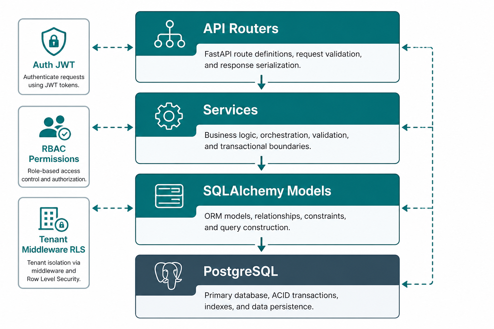
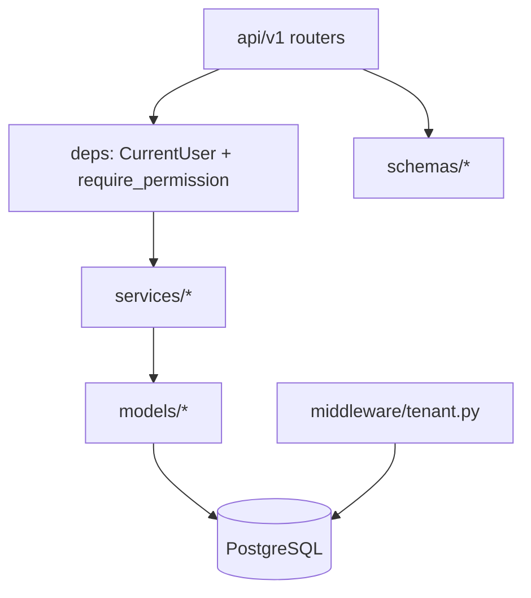
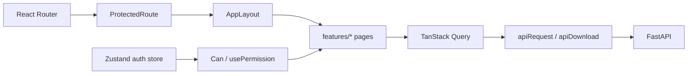
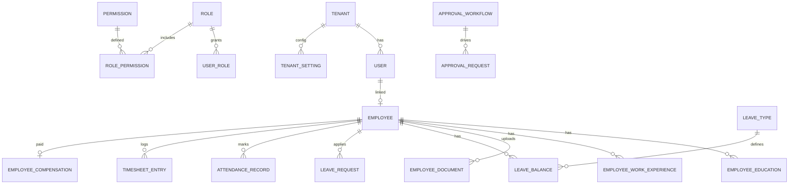
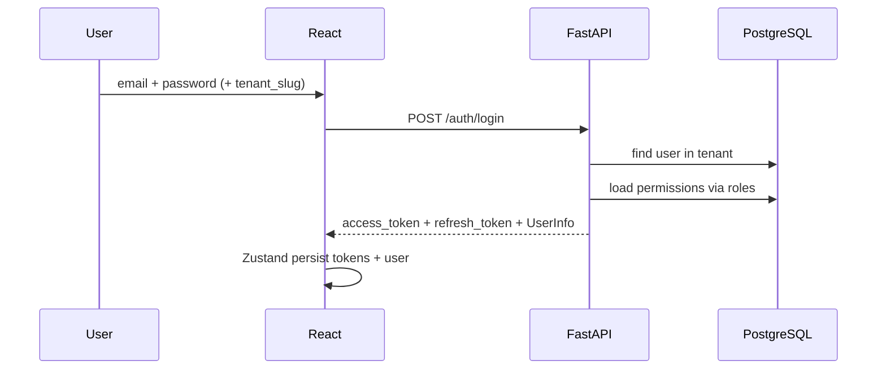
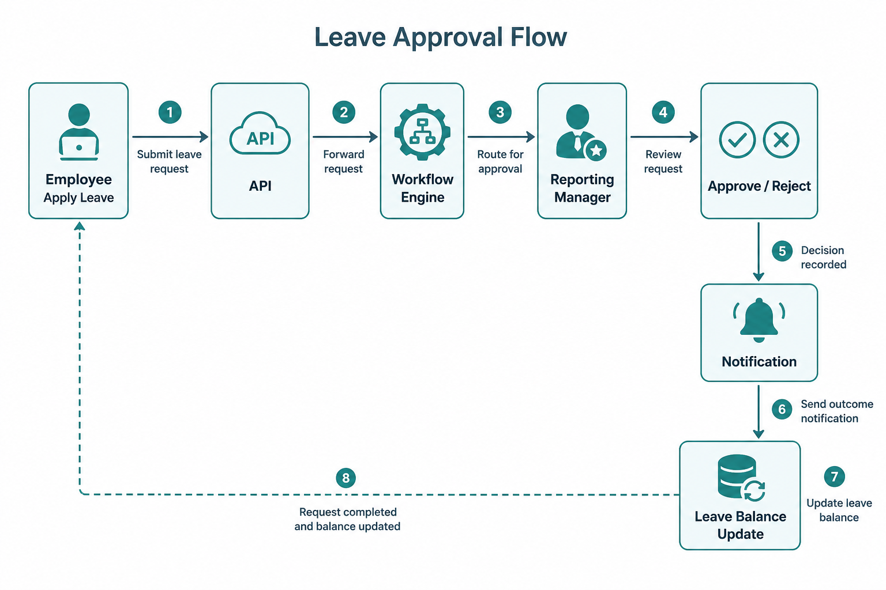
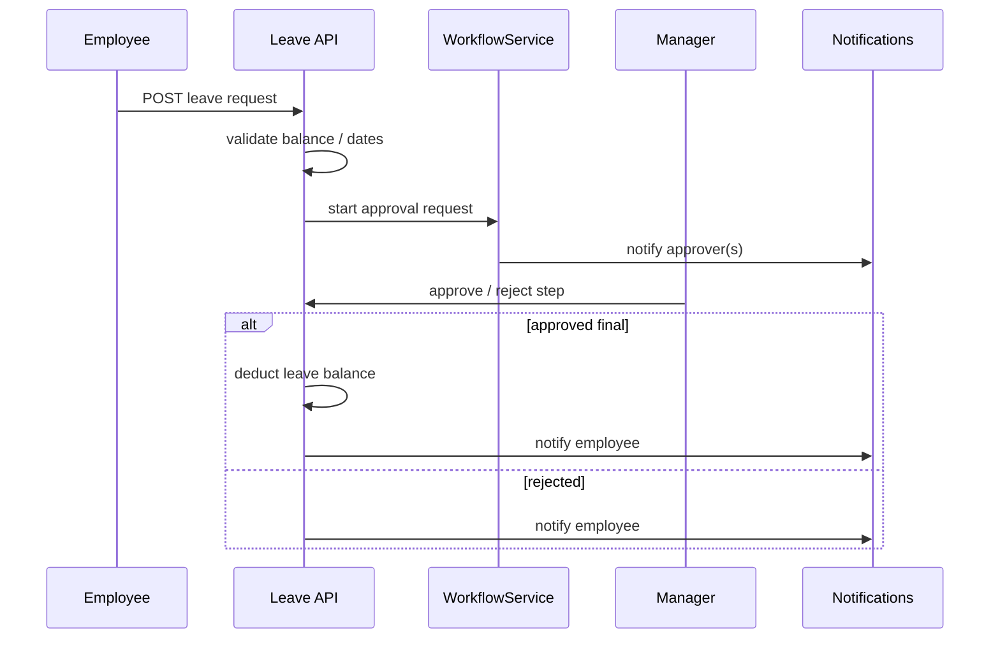
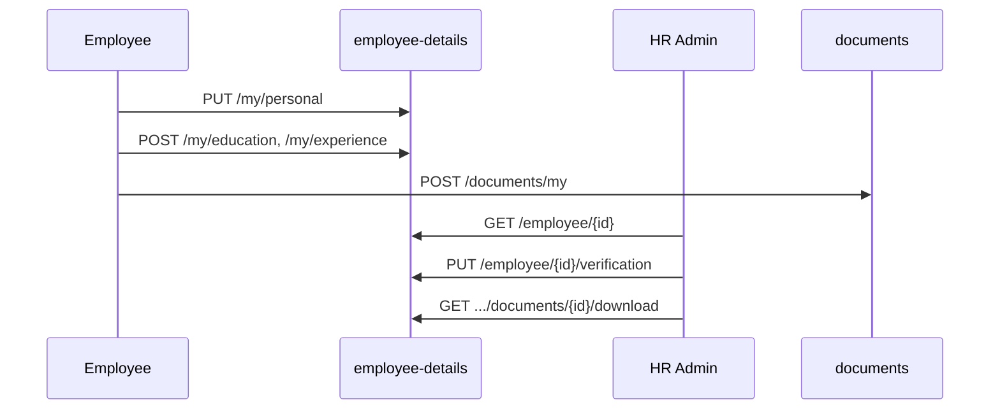
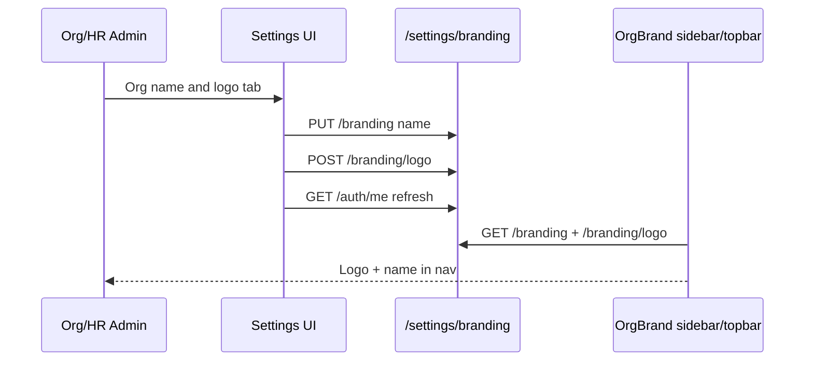

# EmployeeMint — Low Level Design (LLD)

**Product:** Multi-tenant HRMS SaaS  
**Audience:** Developers implementing or extending modules  
**Related:** [HLD](./HLD.md) · [SPEC](./SPEC.md)

---

## 1. Purpose

This LLD describes **how** EmployeeMint is structured: repository layout, backend layers, frontend patterns, core data entities, API surfaces, and detailed sequences for critical flows.

---

## 2. Repository layout

```
EmployeeMint/
├── backend/
│   ├── alembic/versions/          # Migrations 001–009+
│   ├── app/
│   │   ├── api/v1/                # FastAPI routers
│   │   ├── core/                  # config, security, permissions_seed
│   │   ├── middleware/            # tenant RLS, logging
│   │   ├── models/                # SQLAlchemy models
│   │   ├── schemas/               # Pydantic DTOs
│   │   ├── services/              # Business logic
│   │   ├── workers/               # Celery tasks
│   │   ├── scripts/seed.py
│   │   └── main.py
│   ├── uploads/                   # Avatars, logos, documents (dev)
│   └── requirements.txt
├── frontend/
│   └── src/
│       ├── api/client.ts
│       ├── app/                   # Layout, routes, guards
│       ├── components/            # Shared UI (OrgBrand, TopBar, …)
│       ├── features/              # Page modules
│       ├── hooks/                 # usePermission
│       ├── store/                 # auth, theme (Zustand)
│       └── lib/
├── docs/
│   ├── HLD.md
│   ├── LLD.md
│   ├── SPEC.md
│   └── assets/                    # Architecture / flow images
└── docker-compose.yml
```

---

## 3. Backend layered design





| Layer | Responsibility | Examples |
|-------|----------------|----------|
| **Router** | HTTP, auth deps, status codes | `employees.py`, `leave.py`, `settings.py` |
| **Schema** | Request/response validation | `EmployeeCreate`, `BrandingUpdate` |
| **Service** | Business rules, orchestration | `EmployeeService`, `WorkflowService` |
| **Model** | Persistence mapping | `Employee`, `LeaveRequest`, `Tenant` |
| **Deps** | JWT → `CurrentUser`, permission gates | `require_permission`, `require_any_permission` |

### Tenant middleware (RLS)

After auth resolves `tenant_id`:

1. `SET app.current_tenant_id = '<uuid>'` on the DB session.
2. RLS policies filter rows for that tenant.
3. Application still filters by `tenant_id` defensively.

---

## 4. Frontend architecture



| Concern | Implementation |
|---------|----------------|
| Auth persistence | Zustand + `localStorage` (`employeemint-auth`) |
| Server cache | TanStack Query keys (`employees`, `branding`, `my-team`, …) |
| Permissions | `usePermission` / `useAnyPermission` / `<Can>` |
| Module nav | `useModuleVisible(module)` maps module → permission prefixes |
| Branding | `OrgBrand` loads `/settings/branding` + logo blob |
| Theming | CSS variables via theme store (accent colors) |

### Route map (tenant app)

| Path | Feature |
|------|---------|
| `/login` | Tenant login |
| `/app/dashboard` | Dashboard |
| `/app/employees` | Employees + Background modal |
| `/app/attendance` | Attendance |
| `/app/leave` | Leave |
| `/app/timesheets` | Timesheets |
| `/app/finance` | My Pay / tax / admin payroll |
| `/app/approvals` | Approvals inbox |
| `/app/organization` | Org chart |
| `/app/my-team` | Team (reportees or peers) |
| `/app/profile` | Profile + background details |
| `/app/settings` | Branding, holidays, roles, … |
| `/app/setup` | Setup wizard |
| `/platform/*` | Platform admin |

---

## 5. Core data model (logical)



### Important entities

| Entity | Notes |
|--------|-------|
| `Tenant` | `name`, `slug`, `logo_path`, `enabled_modules`, `is_setup_complete` |
| `User` | Login identity; optional `Employee` |
| `Employee` | Org person; manager via `reports_to_employee_id`; personal/ID fields |
| `EmployeeEducation` / `EmployeeWorkExperience` | Profile background |
| `EmployeeDocument` | Uploaded files (identity, bank, …) |
| `LeaveType` / `LeaveBalance` / `LeaveRequest` | Leave domain |
| `AttendanceRecord` | Daily check-in/out |
| `ApprovalWorkflow` + steps | Configurable approver rules |
| `EmployeeCompensation` | CTC / salary structure |
| `OnboardingTask` / `OfferLetter` / `ExitRequest` | Lifecycle |
| `Announcement` / `Notification` | Comms |

Soft-delete: `is_deleted` on tenant-scoped tables via mixin.

---

## 6. Auth & RBAC (detail)

### Login sequence



### `UserInfo` (claims used by UI)

- `tenant_id`, `tenant_slug`, `tenant_name`, `has_logo`
- `employee_id`, `employee_code`, `full_name`, …
- `permissions[]`, `is_setup_complete`, `is_impersonation`

### Permission check

```text
require_permission("leave.apply")
  → *  OR  leave.apply  OR  leave.*
```

Default roles seeded in `permissions_seed.py`: Org Admin, HR Admin, HR Executive, Reporting Manager, Finance Admin, Employee.

---

## 7. API surface (by domain)

Base prefix: `/api/v1`

| Domain | Prefix / routes | Key permissions |
|--------|-----------------|-----------------|
| Auth | `/auth/login`, `/me`, avatar | authenticated |
| Platform | `/platform/tenants` | `platform.*` |
| Setup | `/setup/*` | tenant admin |
| Employees | `/employees` | `employee.view.*` / `edit.*` / `create` |
| Background | `/employee-details/my`, `/employee/...` | `employee.view.own` / `view.all` / `edit.*` |
| Documents | `/documents/my`, types | own / `onboarding.manage` |
| Leave | `/leave/*` | `leave.apply`, `leave.manage`, … |
| Attendance | `/attendance/*` | `attendance.mark.own`, … |
| Timesheets | `/timesheets/*` | `timesheet.submit` / `approve` |
| Finance | `/finance/*` | `payroll.view.*`, `payroll.process` |
| Approvals | `/approvals/*` | `approvals.view` / `action` |
| Org / team | `/organization/tree`, `/my-team` | `org.view`, `employee.view.team` |
| Settings | holidays, leave-types, roles, announcements, **branding** | `settings.manage`, `org.manage`, … |
| Lifecycle | onboarding, offboarding, offer letters | lifecycle perms |

OpenAPI UI: `http://localhost:8000/docs`

---

## 8. Critical flow — leave approval





**Approver rules** (workflow steps) typically include reporting manager; missing manager surfaces a clear error asking HR to set `reports_to_employee_id`.

---

## 9. Critical flow — employee background (profile + HR)



Access:

- Own: `employee.view.own` / `employee.edit.own`
- HR: `employee.view.all` / `employee.edit.all`
- UI: Profile page (self) · Employees → **Background** (HR)

---

## 10. Critical flow — org branding



Stored on `tenants.name`, `tenants.logo_path`, `tenants.logo_content_type`.

---

## 11. My Team resolution

```text
get_my_team(employee_id):
  reportees = all direct + indirect under employee
  if reportees: return (reportees, "reportees")
  else: return (peers under same manager, "peers")
```

Peers exclude self; UI labels relation as Peer vs L1/L2 reportees.

---

## 12. File storage conventions

| Asset | Path pattern | Service |
|-------|--------------|---------|
| Avatar | `uploads/avatars/{tenant}/{employee}/…` | `AvatarService` |
| Org logo | `uploads/logos/{tenant}/…` | `BrandingService` |
| Documents | under document service paths | `DocumentService` |

Dev uses local disk; compose includes MinIO for S3-compatible evolution.

---

## 13. Migrations snapshot

| Rev | Change |
|-----|--------|
| 001 | Initial schema |
| 002 | Module tables |
| 003 | WFH + timesheets |
| 004 | Employee compensation |
| 005 | Employee documents |
| 006 | Announcement `show_on_dashboard` |
| 007 | Employee avatar |
| 008 | Personal / education / work experience + verification |
| 009 | Tenant logo branding |

Apply: `alembic upgrade head`

---

## 14. Frontend component contracts (selected)

| Component | Role |
|-----------|------|
| `AppLayout` | Sidebar nav + outlet; module visibility |
| `OrgBrand` | Logo + org name (query `branding`) |
| `TopBar` | Brand left; notifications + user menu |
| `Can` | Conditionally render by permission |
| `EmployeeBackgroundDetails` | Shared profile/HR background UI |
| `AnnouncementTicker` | Dashboard strip announcements |

---

## 15. Error & security conventions

- API errors: `{ "detail": { "error": { "code": "...", "message": "..." } } }`
- Frontend parses `detail.error.message` for user-facing text.
- Uploads: magic-byte sniffing for images; size caps (e.g. 2MB logos/avatars).
- Soft deletes preferred over hard deletes for business data.

---

## 16. Extension guide (for new modules)

1. Add permission codes to `permissions_seed.py` + role defaults.
2. Model + Alembic migration (`tenant_id` + mixins).
3. Schema + service + router under `api/v1`.
4. Register router in `api/v1/router.py`.
5. Frontend `features/<module>` page + route in `App.tsx`.
6. Add nav item + `MODULE_PREFIXES` in `usePermission.ts`.
7. Update HLD/LLD briefly if the module is user-facing.

---

## 17. Document map

| Doc | Level |
|-----|-------|
| [HLD](./HLD.md) | Context, stack, users, journeys, images |
| **LLD** (this file) | Structure, ER, APIs, sequences |
| [SPEC](./SPEC.md) | Product contract |

---

*Last updated: July 2026 — aligned with the current EmployeeMint codebase.*
